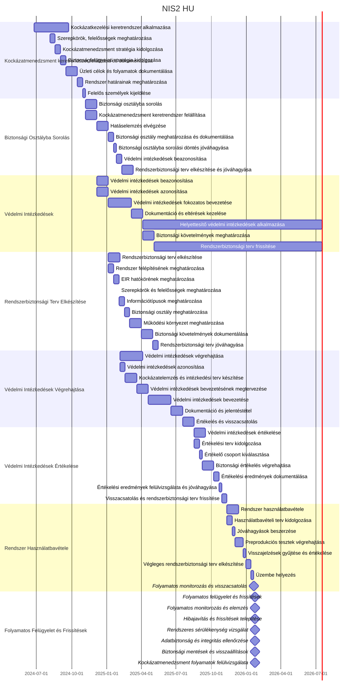

# NIS2 megfelelés feladatai Gantt diagram 

```mermaid
gantt
    title NIS2 HU
    dateFormat  YYYY-MM-DD
    section Kockázatmenedzsment keretrendszer felállítása és dokumentálása
    Kockázatkezelési keretrendszer alkalmazása: KK0, 2024.06.25, 90d
	  Szerepkörök, felelősségek meghatározása :KK1, 2024-08-05, 14d
    Kockázatmenedzsment stratégia kidolgozása :KK2, after KK1, 14d
    Biztonságfelügyeleti stratégia kidolgozása :KK3, after KK2, 14d
    Üzleti célok és folyamatok dokumentálása :KK4, after KK3, 30d
    Rendszer határainak meghatározása :KK5, after KK4, 14d
    Felelős személyek kijelölése :KK6, after KK5, 7d

    section Biztonsági Osztályba Sorolás
	  Biztonsági osztályba sorolás: BO0, after KK6, 30d
    Kockázatmenedzsment keretrendszer felállítása :BO1, after KK6, 30d
    Hatáselemzés elvégzése :BO2, after BO1, 30d
    Biztonsági osztály meghatározása és dokumentálása :BO3, after BO2, 14d
    Biztonsági osztályba sorolási döntés jóváhagyása :BO4, after BO3, 7d
    Védelmi intézkedések beazonosítása :BO5, after BO4, 14d
    Rendszerbiztonsági terv elkészítése és jóváhagyása :BO6, after BO5, 30d

    section Védelmi Intézkedések
    Védelmi intézkedések beazonosítása: VI0, after BO0, 30d
	  Védelmi intézkedések azonosítása :VI1, after BO0, 30d
    Védelmi intézkedések fokozatos bevezetése :VI2, after VI1, 60d
    Dokumentáció és eltérések kezelése :VI3, after VI2, 30d
    Helyettesítő védelmi intézkedések alkalmazása :until isadded
    Biztonsági követelmények meghatározása :VI5, after VI3, 30d
    Rendszerbiztonsági terv frissítése :until isadded

    section Rendszerbiztonsági Terv Elkészítése
	  Rendszerbiztonsági terv elkészítése: RBT0, after VI0, 30d
    Rendszer felépítésének meghatározása :RBT1, after VI0, 14d
    EIR hatókörének meghatározása :RBT2, after RBT1, 14d
    Szerepkörök és felelősségek meghatározása :RBT3, after RBT2, 7n
    Információtípusok meghatározása :RBT4, after RBT3, 14d
    Biztonsági osztály meghatározása :RBT5, after RBT4, 14d
    Működési környezet meghatározása :RBT6, after RBT5, 30d
    Biztonsági követelmények dokumentálása :RBT7, after RBT6, 30d
    Rendszerbiztonsági terv jóváhagyása :RBT8, after RBT7, 14d

    section Védelmi Intézkedések Végrehajtása
    Védelmi intézkedések végrehajtása: VV0, after RBT0, 60d
	  Védelmi intézkedések azonosítása :VV1, after RBT0, 14d
    Kockázatelemzés és intézkedési terv készítése :VV2, after VV1, 30d
    Védelmi intézkedések bevezetésének megtervezése :VV3, after VV2, 30d
    Védelmi intézkedések bevezetése :VV4, after VV3, 60d
    Dokumentáció és jelentéstétel :VV5, after VV4, 30d
    Értékelés és visszacsatolás :VV6, after VV5, 30d

    section Védelmi Intézkedések Értékelése
	  Védelmi intézkedések értékelése: VE0, after VV6, 30d
    Értékelési terv kidolgozása :VE1, after VV6, 14d
    Értékelő csoport kiválasztása :VE2, after VE1, 7d
    Biztonsági értékelés végrehajtása :VE3, after VE2, 30d
    Értékelési eredmények dokumentálása :VE4, after VE3, 14d
    Értékelési eredmények felülvizsgálata és jóváhagyása :VE5, after VE4, 7d
    Visszacsatolás és rendszerbiztonsági terv frissítése :VE6, after VE5, 14d

    section Rendszer Használatbavétele
	  Rendszer használatbavétele: RH0, after VE6, 30d
    Használatbavételi terv kidolgozása :RH1, after VE6, 14d
    Jóváhagyások beszerzése :RH2, after RH1, 7d
    Preprodukciós tesztek végrehajtása :RH3, after RH2, 21d
    Visszajelzések gyűjtése és értékelése :RH4, after RH3, 7d
    Végleges rendszerbiztonsági terv elkészítése :RH5, after RH4, 14d
    Üzembe helyezés :RH6, after RH5, 7d
    Folyamatos monitorozás és visszacsatolás :milestone, after RH6, 1d

    section Folyamatos Felügyelet és Frissítések
	  Folyamatos felügyelet és frissítések:milestone, after RH6, 7d
    Folyamatos monitorozás és elemzés : milestone, after RH6, 7d
    Hibajavítás és frissítések telepítése : milestone, after RH6, 7d
    Rendszeres sérülékenység vizsgálat : milestone, after RH6, 7d
    Adatbiztonság és integritás ellenőrzése : milestone, after RH6, 7d
    Biztonsági mentések és visszaállítások : milestone, after RH6, 7d
    Kockázatmenedzsment folyamatok felülvizsgálata : milestone, after RH6, 7d
```
