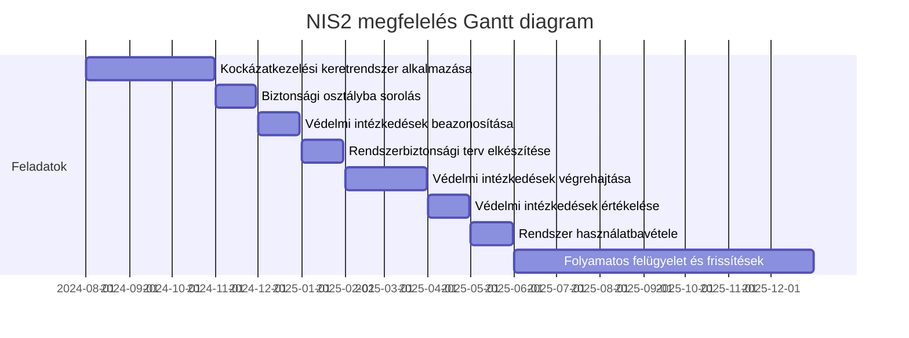

```mermaid
gantt
    title NIS2 megfelelés Gantt diagram
    dateFormat  YYYY-MM-DD
    section Feladatok
    Kockázatkezelési keretrendszer alkalmazása :2024-08-01, 2024-10-31
    Biztonsági osztályba sorolás :2024-11-01, 2024-11-30
    Védelmi intézkedések beazonosítása :2024-12-01, 2024-12-31
    Rendszerbiztonsági terv elkészítése :2025-01-01, 2025-01-31
    Védelmi intézkedések végrehajtása :2025-02-01, 2025-03-31
    Védelmi intézkedések értékelése :2025-04-01, 2025-04-30
    Rendszer használatbavétele :2025-05-01, 2025-05-31
    Folyamatos felügyelet és frissítések :2025-06-01, 2025-12-31
```
