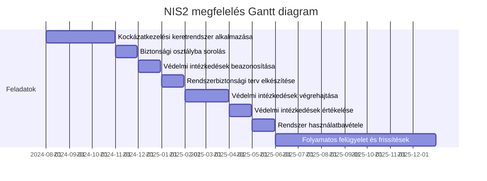

## Biztonsági osztályba sorolás:
A 7/2024. MK rendelet alapján a biztonsági osztályba sorolás alatti al-feladatok a következők:

1. **Kockázatmenedzsment keretrendszer felállítása és dokumentálása:**

* **Feladat:** A keretrendszer alkalmazására való felkészülés, amely magában foglalja az elektronikus információs rendszerek védelmével kapcsolatos szerepkörök, felelősségek, feladatok és hatáskörök meghatározását és dokumentálását .
* **Határidő:** A jogszabály hatályba lépését követő 1 hónap.

1. **Hatáselemzés elvégzése:**

* **Feladat:** A szervezet elvégzi az elektronikus információs rendszerek hatáselemzését, amely alapján meghatározza a rendszerek biztonsági osztályát .
* **Határidő:** A keretrendszer felállítását követő 1 hónap.
1. **Biztonsági osztály meghatározása és dokumentálása:**

* **Feladat:** Az elektronikus információs rendszerek biztonsági osztályba sorolása a hatáselemzés eredményei alapján, majd az eredmények dokumentálása a rendszerbiztonsági tervben .
* **Határidő:** A hatáselemzés elvégzését követő 2 hét.

1. **Biztonsági osztályba sorolási döntés jóváhagyása:**

* **Feladat:** A szervezet vezetője jóváhagyja a biztonsági osztályba sorolási döntést .
* **Határidő:** A biztonsági osztály meghatározását követő 1 hét.

1. **Védelmi intézkedések beazonosítása:**

* **Feladat:** A biztonsági osztályhoz tartozó védelmi intézkedések azonosítása a kockázatmenedzsment keretrendszer alapján .
* **Határidő:** A biztonsági osztály meghatározását követő 2 hét.

1. **Rendszerbiztonsági terv elkészítése és jóváhagyása:**

* **Feladat:** A rendszerbiztonsági terv elkészítése, amely tartalmazza a biztonsági osztályba sorolás eredményeit és az azonosított védelmi intézkedéseket .
* **Határidő:** A védelmi intézkedések azonosítását követő 1 hónap.

