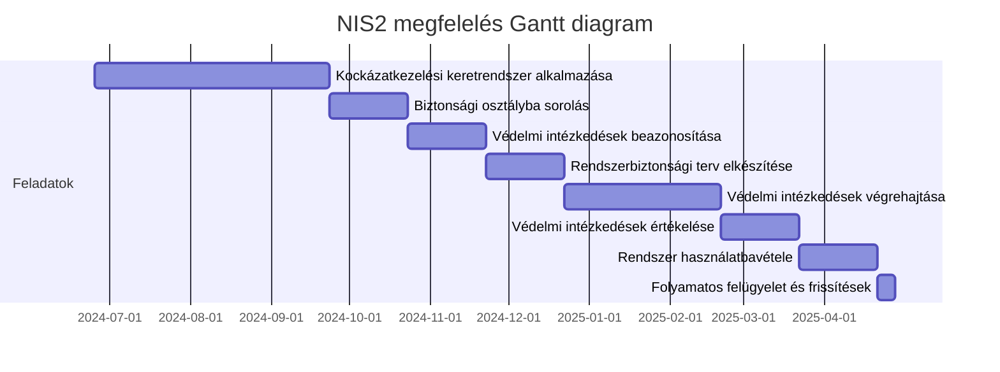
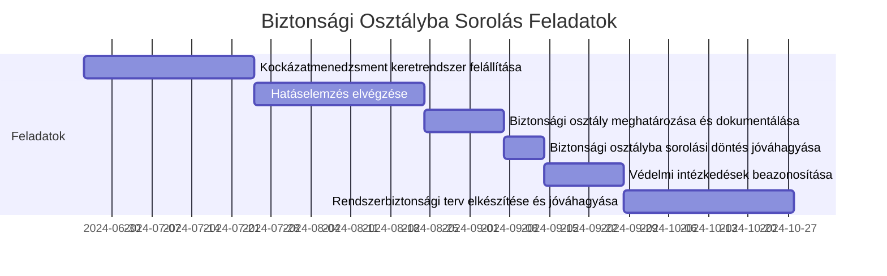
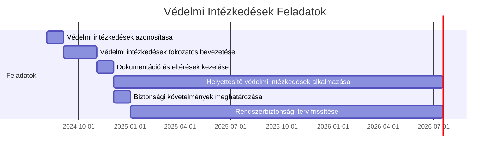
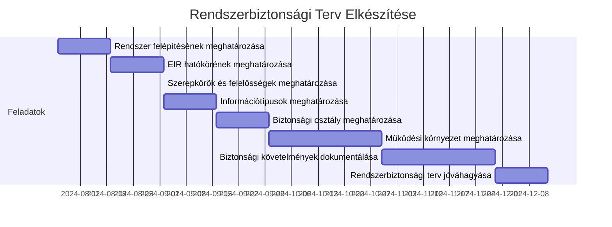
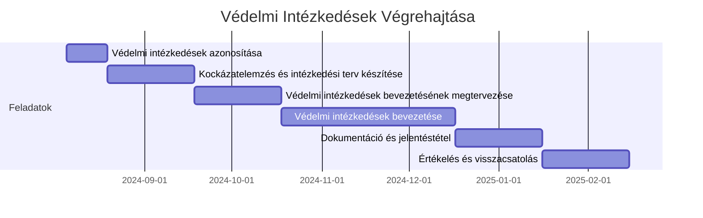
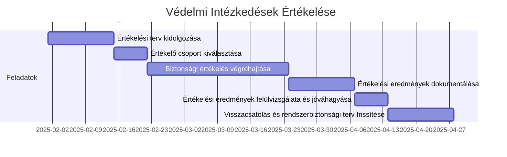
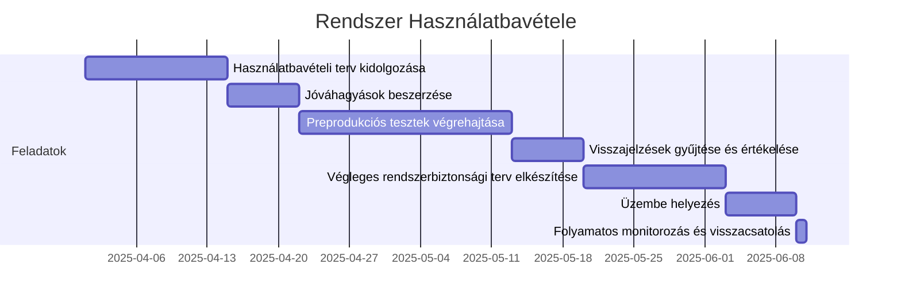
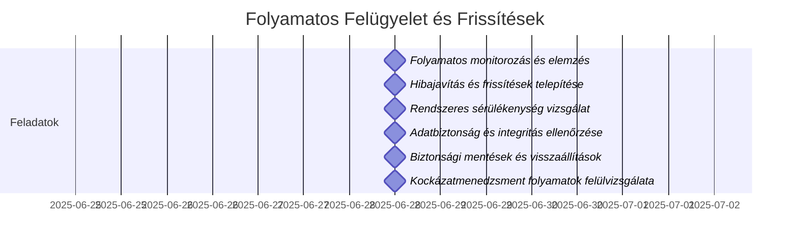

# NIS2 Keretrendszer alkalmazása, feladatok, határidők (relatív kezdődátumokkal)

> Az alábbiakban vagy a jogszabályban meghatározott fix kezdődátummal meghatározott, vagy 2024. augusztus 01-i indulás szerint kerülnek kerültek meghatározásra a Gantt diagrammok. [Egy másik oldalon összesített diagramban](NIS2 Gantt.md) található a teljes feladatkör, a jogszabályban meghatározott fix dátumok alapján.
> A lent található Gantt diagramokat kimásolva (a diagram jobb felső sarkában található copy ikonra kattintva), azok kezdő dátumát módosítva bárki személyre tudja szabni magának az ábrát, mely alapján meg tudja határozni az egyes tevékenységekhez szükséges időkereteket.

1. **Kockázatkezelési keretrendszer alkalmazása**

* **Feladat:** Felkészülés a keretrendszer alkalmazására
* **Határidő:** A jogszabály hatályba lépésétől számított 3 hónap
* **Felelős:** Szervezet vezetője

2. **Biztonsági osztályba sorolás**

* **Feladat:** Az elektronikus információs rendszerek biztonsági osztályba sorolása
* **Határidő:** A kockázatkezelési keretrendszer felállítását követően 1 hónap
* **Felelős:** Kijelölt biztonsági szakértő

3. **Védelmi intézkedések beazonosítása**

* **Feladat:** A biztonsági osztályhoz tartozó védelmi intézkedések azonosítása
* **Határidő:** A biztonsági osztályba sorolást követően 1 hónap
* **Felelős:** Biztonsági csapat

4. **Rendszerbiztonsági terv elkészítése**

* **Feladat:** A kiválasztott védelmi intézkedések dokumentálása a rendszerbiztonsági tervben
* **Határidő:** A védelmi intézkedések azonosítását követően 1 hónap
* **Felelős:** Biztonsági csapat

5. **Védelmi intézkedések végrehajtása**

* **Feladat:** A rendszerbiztonsági tervben dokumentált intézkedések végrehajtása
* **Határidő:** A rendszerbiztonsági terv elkészítését követően 2 hónap
* **Felelős:** IT és biztonsági csapat

6. **Védelmi intézkedések értékelése**

* **Feladat:** A megvalósított védelmi intézkedések értékelése
* **Határidő:** A végrehajtás befejezését követően 1 hónap
* **Felelős:** Kijelölt biztonsági szakértők

7. **Rendszer használatbavétele**

* **Feladat:** Döntés a rendszer használatbavételéről vagy folytatásáról
* **Határidő:** A védelmi intézkedések értékelését követően 1 hónap
* **Felelős:** Szervezet vezetője

8. **Folyamatos felügyelet és frissítések**

* **Feladat:** A védelmi intézkedések folyamatos felügyelete és a szükséges frissítések elvégzése
* **Határidő:** Folyamatosan, évente legalább egyszer
* **Felelős:** Biztonsági csapat

## Kockázatmenedzsment keretrendszer felállítása és dokumentálása

A 7/2024. MK rendelet alapján a Kockázatmenedzsment keretrendszer felállítása és dokumentálása alatti al-feladatok és határidők a következők:

1. **Szerepkörök, felelősségek, feladatok és hatáskörök meghatározása és dokumentálása**

* **Feladat:** Meghatározni és dokumentálni az elektronikus információs rendszerek védelmével kapcsolatos szerepköröket, felelősségeket, feladatokat és hatásköröket.
* **Határidő:** A keretrendszer felállításának kezdetétől számított 2 hét.

2. **Kockázatmenedzsment stratégia kidolgozása és dokumentálása**

* **Feladat:** Kidolgozni és dokumentálni a kockázatmenedzsment stratégiát, amely leírja, hogyan azonosítja, értékeli, kezeli és felügyeli a szervezet a biztonsági kockázatokat.
* **Határidő:** Az első feladat befejezését követően 2 hét.

3. **Biztonságfelügyeleti stratégia kidolgozása és dokumentálása**

* **Feladat:** Kidolgozni és dokumentálni a biztonságfelügyeleti stratégiát, amely magában foglalja a védelmi intézkedésekhez kapcsolódó tevékenységek ellenőrzésének gyakoriságát, felügyeletének módszereit és eszközeit.
* **Határidő:** A kockázatmenedzsment stratégia befejezését követően 2 hét.

4. **Üzleti célok, funkciók és folyamatok meghatározása és dokumentálása**

* **Feladat:** Meghatározni és dokumentálni az elektronikus információs rendszerek által támogatandó üzleti célokat, funkciókat és folyamatokat.
* **Határidő:** A biztonságfelügyeleti stratégia befejezését követően 1 hónap.

5. **Rendszer határainak meghatározása és dokumentálása**

* **Feladat:** Meghatározni és dokumentálni a rendszer szervezeti és technológiai határait, valamint az érintett vagyonelemeket, és az adatköröket.
* **Határidő:** Az üzleti célok és folyamatok dokumentálását követően 2 hét.

6. **Felelős személyek kijelölése**

* **Feladat:** Kijelölni a kockázatmenedzsment feladatokért felelős személyeket és dokumentálni a nevüket és felelősségi körüket.
* **Határidő:** A rendszer határainak meghatározását követően 1 hét.

## Biztonsági osztályba sorolás:
A 7/2024. MK rendelet alapján a biztonsági osztályba sorolás alatti al-feladatok a következők:

1. **Kockázatmenedzsment keretrendszer felállítása és dokumentálása:**

* **Feladat:** A keretrendszer alkalmazására való felkészülés, amely magában foglalja az elektronikus információs rendszerek védelmével kapcsolatos szerepkörök, felelősségek, feladatok és hatáskörök meghatározását és dokumentálását .
* **Határidő:** A jogszabály hatályba lépését követő 1 hónap.

2. **Hatáselemzés elvégzése:**

* **Feladat:** A szervezet elvégzi az elektronikus információs rendszerek hatáselemzését, amely alapján meghatározza a rendszerek biztonsági osztályát .
* **Határidő:** A keretrendszer felállítását követő 1 hónap.

3. **Biztonsági osztály meghatározása és dokumentálása:**

* **Feladat:** Az elektronikus információs rendszerek biztonsági osztályba sorolása a hatáselemzés eredményei alapján, majd az eredmények dokumentálása a rendszerbiztonsági tervben .
* **Határidő:** A hatáselemzés elvégzését követő 2 hét.

4. **Biztonsági osztályba sorolási döntés jóváhagyása:**

* **Feladat:** A szervezet vezetője jóváhagyja a biztonsági osztályba sorolási döntést .
* **Határidő:** A biztonsági osztály meghatározását követő 1 hét.

5. **Védelmi intézkedések beazonosítása:**

* **Feladat:** A biztonsági osztályhoz tartozó védelmi intézkedések azonosítása a kockázatmenedzsment keretrendszer alapján .
* **Határidő:** A biztonsági osztály meghatározását követő 2 hét.

6. **Rendszerbiztonsági terv elkészítése és jóváhagyása:**

* **Feladat:** A rendszerbiztonsági terv elkészítése, amely tartalmazza a biztonsági osztályba sorolás eredményeit és az azonosított védelmi intézkedéseket .
* **Határidő:** A védelmi intézkedések azonosítását követő 1 hónap.

## Védelmi intézkedések

A 7/2024. MK rendelet alapján a védelmi intézkedések feladatának alábbi al-feladatai és határidői a következők:

1. **Védelmi intézkedések azonosítása**
   * **Feladat:** Az elektronikus információs rendszer azon komponenseinek meghatározása, amelyek a védelmi intézkedések által megcélzott biztonsági képességet biztosítják vagy támogatják.
   * **Határidő:** A kockázatmenedzsment keretrendszer felállítását követően 1 hónap.

2. **Védelmi intézkedések fokozatos bevezetése**
   * **Feladat:** A védelmi intézkedések fokozatos bevezetése a védendő elektronikus információs rendszerek biztonsági osztályozása alapján.
   * **Határidő:** Az intézkedések azonosítását követően 2 hónap.

3. **Dokumentáció és eltérések kezelése**
   * **Feladat:** A védelmi intézkedések dokumentálása, beleértve az egyedi eltérések okait és mértékét, valamint azok megfelelőségének és hatékonyságának felülvizsgálata.
   * **Határidő:** A védelmi intézkedések fokozatos bevezetését követően 1 hónap.

4. **Helyettesítő védelmi intézkedések alkalmazása**
   * **Feladat:** Azon esetekben, amikor az adott biztonsági osztályhoz tartozó védelmi intézkedés nem alkalmazható, egyenértékű vagy összemérhető védelmet nyújtó helyettesítő intézkedések alkalmazása.
   * **Határidő:** Folyamatosan, a helyettesítési igény felmerülésekor.

5. **Biztonsági követelmények meghatározása**
   * **Feladat:** Az elektronikus információs rendszerekre értelmezendő és alkalmazandó biztonsági követelmények megállapítása, a kockázatelemzés alapján testre szabva.
   * **Határidő:** A dokumentáció és eltérések kezelését követően 1 hónap.

6. **Rendszerbiztonsági terv frissítése**
   * **Feladat:** A védelmi intézkedések tényleges megvalósítása és a tervtől való eltérések alapján a rendszerbiztonsági terv frissítése.
   * **Határidő:** Folyamatosan, a védelmi intézkedések végrehajtása során.

## Rendszerbiztonsági terv elkészítése

A 7/2024. MK rendelet alapján a rendszerbiztonsági terv elkészítése során a következő al-feladatok és határidők szerepelnek:

1. **A rendszer felépítésének és elemeinek meghatározása és dokumentálása**
   * **Feladat:** Meghatározni és dokumentálni az elektronikus információs rendszer (EIR) felépítését és elemeit.
   * **Határidő:** 2 hét.

2. **Az EIR hatókörének és alapfeladatainak meghatározása és dokumentálása**
   * **Feladat:** Az EIR hatókörének, alapfeladatainak és biztosítandó szolgáltatásainak dokumentálása az üzleti folyamatok szempontjából.
   * **Határidő:** Az első feladat befejezését követő 2 hét.

3. **Szerepkörök és felelősségek meghatározása és dokumentálása**
   * **Feladat:** Azonosítani és dokumentálni az EIR-hez kapcsolódó szerepköröket és felelősségeket betöltő személyeket.
   * **Határidő:** Az előző feladatok befejezését követő 1 hét.

4. **Az EIR által feldolgozott, tárolt és továbbított információtípusok meghatározása**
   * **Feladat:** Dokumentálni az EIR által kezelt adatköröket és azok életciklusát.
   * **Határidő:** Az előző feladat befejezését követő 2 hét.

5. **Az EIR biztonsági osztályának meghatározása és dokumentálása**
   * **Feladat:** Az EIR biztonsági osztályának meghatározása és alátámasztása megfelelő módon.
   * **Határidő:** Az információtípusok meghatározását követően 2 hét.

6. **Az EIR működési környezetének és kapcsolódó rendszerelemek meghatározása**
   * **Feladat:** Az EIR működési környezetének és a kapcsolódó vagy függő rendszerelemek meghatározása és dokumentálása.
   * **Határidő:** A biztonsági osztály meghatározását követően 1 hónap.

7. **A rendszerre vonatkozó biztonsági követelmények dokumentálása**
   * **Feladat:** Dokumentálni a rendszerre vonatkozó biztonsági követelményeket, beleértve a szükséges védelmi intézkedéseket.
   * **Határidő:** Az EIR működési környezetének meghatározását követően 1 hónap.

8. **A rendszerbiztonsági terv jóváhagyása és megismertetése**
   * **Feladat:** Gondoskodni arról, hogy a rendszerbiztonsági tervet a meghatározott személyek és szerepkörök megismerjék, és a felelős vezetők jóváhagyják a tervet.
   * **Határidő:** A biztonsági követelmények dokumentálását követően 2 hét.

## Védelmi intézkedések végrehajtása

A 7/2024. MK rendelet alapján a védelmi intézkedések végrehajtásához kapcsolódó al-feladatok és határidők a következők:

1. **Védelmi intézkedések azonosítása**
   - **Feladat:** Az elektronikus információs rendszer azon komponenseinek meghatározása, amelyek a védelmi intézkedések által megcélzott biztonsági képességet biztosítják vagy támogatják.
   - **Határidő:** A rendszerbiztonsági terv elkészítése után azonnal kezdődő 2 hét.

2. **Kockázatelemzés és intézkedési terv készítése**
   - **Feladat:** Kockázatelemzés végrehajtása, majd az eredmények alapján az intézkedési terv elkészítése.
   - **Határidő:** Az azonosítás után 1 hónap.

3. **Védelmi intézkedések bevezetésének megtervezése**
   - **Feladat:** A védelmi intézkedések bevezetésének részletes tervezése, beleértve a szükséges erőforrásokat és ütemtervet.
   - **Határidő:** Az intézkedési terv elkészítése után 1 hónap.

4. **Védelmi intézkedések bevezetése**
   - **Feladat:** A tervezett védelmi intézkedések végrehajtása a meghatározott ütemterv szerint.
   - **Határidő:** A bevezetés megtervezése után 2 hónap.

5. **Dokumentáció és jelentéstétel**
   - **Feladat:** A végrehajtott védelmi intézkedések dokumentálása és jelentések készítése az eredményekről.
   - **Határidő:** A végrehajtás után folyamatosan, a feladatok befejezése után 1 hónap.

6. **Értékelés és visszacsatolás**
   * **Feladat:** A végrehajtott védelmi intézkedések értékelése és a visszacsatolás beépítése a rendszerbiztonsági tervbe.
   * **Határidő:** A dokumentáció befejezését követően 1 hónap.

## Védelmi intézkedések értékelése

A 7/2024. MK rendelet alapján a védelmi intézkedések értékelése során az alábbi al-feladatok és határidők szerepelnek:

1. **Értékelési terv kidolgozása**
   - **Feladat:** Az értékelési terv kidolgozása, amely leírja az értékelés hatókörét, beleértve az értékelendő védelmi intézkedéseket, azok kiterjesztését és továbbfejlesztését.
   - **Határidő:** A védelmi intézkedések végrehajtásának befejezését követően 2 hét.

2. **Értékelő csoport kiválasztása**
   - **Feladat:** Az értékelési tervnek megfelelő értékelő csoport vagy független értékelők kiválasztása.
   - **Határidő:** Az értékelési terv kidolgozását követően 1 hét.

3. **Biztonsági értékelés végrehajtása**
   - **Feladat:** A meghatározott biztonsági értékelési módszerek és eszközök alkalmazása, beleértve a mélységi monitorozást, automatizált biztonsági teszteket, sérülékenységszkennelést, rosszhiszemű felhasználói teszteket, stb.
   - **Határidő:** Az értékelő csoport kiválasztását követően 1 hónap.

4. **Értékelési eredmények dokumentálása**
   - **Feladat:** Az értékelési eredmények dokumentálása és jelentés készítése, amely összefoglalja az értékelés eredményeit, beleértve az azonosított kockázatokat és javasolt intézkedéseket.
   - **Határidő:** A biztonsági értékelés végrehajtását követően 2 hét.

5. **Értékelési eredmények felülvizsgálata és jóváhagyása**
   - **Feladat:** Az értékelési eredmények felülvizsgálata és jóváhagyása a szervezet vezetői által.
   - **Határidő:** Az értékelési eredmények dokumentálását követően 1 hét.

6. **Visszacsatolás és rendszerbiztonsági terv frissítése**
   * **Feladat:** Az értékelési eredmények alapján szükséges visszacsatolás biztosítása és a rendszerbiztonsági terv frissítése.
   * **Határidő:** Az értékelési eredmények jóváhagyását követően 2 hét.

## Rendszer használatbavétele

A 7/2024. MK rendelet alapján a rendszer használatbavételéhez kapcsolódó al-feladatok és határidők a következők:

1. **Használatbavételi terv kidolgozása**
   - **Feladat:** Kidolgozni egy részletes tervet a rendszer használatbavételére, beleértve az összes szükséges lépést és felelősségeket.
   - **Határidő:** A védelmi intézkedések értékelését követően 2 hét.

2. **Jóváhagyások beszerzése**
   - **Feladat:** A használatbavételi terv jóváhagyása a szervezet vezetése és a biztonsági szakértők által.
   - **Határidő:** A terv elkészítését követően 1 hét.

3. **Preprodukciós tesztek végrehajtása**
   - **Feladat:** A rendszer preprodukciós környezetben történő tesztelése, hogy biztosítsák a rendszer megfelelőségét és a védelmi intézkedések hatékonyságát.
   - **Határidő:** A jóváhagyások megszerzését követően 3 hét .

4. **Visszajelzések gyűjtése és értékelése**
   - **Feladat:** A tesztek eredményeinek összegyűjtése és értékelése, valamint az esetleges szükséges módosítások bevezetése.
   - **Határidő:** A tesztelést követően 1 hét.

5. **Végleges rendszerbiztonsági terv elkészítése**
   - **Feladat:** A végleges rendszerbiztonsági terv elkészítése, amely tartalmazza az összes jóváhagyott és végrehajtott védelmi intézkedést.
   - **Határidő:** A visszajelzések értékelését követően 2 hét.

6. **Üzembe helyezés**
   - **Feladat:** A rendszer éles üzembe helyezése a végleges terv alapján.
   - **Határidő:** A végleges terv elkészítését követően 1 hét.

7. **Folyamatos monitorozás és visszacsatolás**
   - **Feladat:** A rendszer folyamatos monitorozása és az esetleges visszacsatolások alapján történő folyamatos javítás.
   - **Határidő:** Folyamatosan, az üzembe helyezést követően.

## Folyamatos felügyelet és frissítések

A 7/2024. MK rendelet alapján a folyamatos felügyelet és frissítések alatti al-feladatok és határidők a következők:

1. **Folyamatos monitorozás és elemzés**
   - **Feladat:** Az elektronikus információs rendszer (EIR) folyamatos monitorozása, beleértve a biztonsági események valós idejű elemzését automatizált eszközök segítségével.
   - **Határidő:** Folyamatos.

2. **Hibajavítás és frissítések telepítése**
   - **Feladat:** A hibajavítások és biztonsági frissítések rendszeres telepítése, beleértve a szoftver- és firmware-frissítéseket.
   - **Határidő:** Folyamatos, a frissítések megjelenését követően azonnal.

3. **Rendszeres sérülékenység vizsgálat**
   - **Feladat:** Rendszeres sérülékenységvizsgálatok végrehajtása, beleértve az automatizált sérülékenységelemzést és a kockázatok értékelését.
   - **Határidő:** Folyamatos, meghatározott időközönként.

4. **Adatbiztonság és integritás ellenőrzése**
   - **Feladat:** Az EIR által kezelt adatok biztonságának és integritásának rendszeres ellenőrzése.
   - **Határidő:** Folyamatos.

5. **Biztonsági mentések és visszaállítások**
   - **Feladat:** Rendszeres biztonsági mentések készítése és a visszaállítási eljárások tesztelése.
   - **Határidő:** Folyamatos, meghatározott időközönként.

6. **Kockázatmenedzsment folyamatok felülvizsgálata**
   - **Feladat:** A kockázatmenedzsment folyamatok és eljárások rendszeres felülvizsgálata és frissítése a változó körülményeknek megfelelően.
   - **Határidő:** Évente legalább egyszer.

