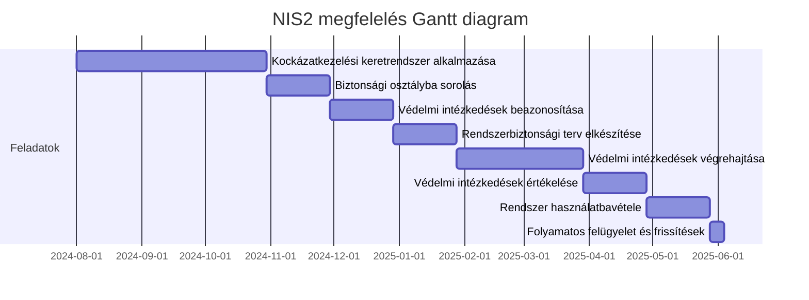
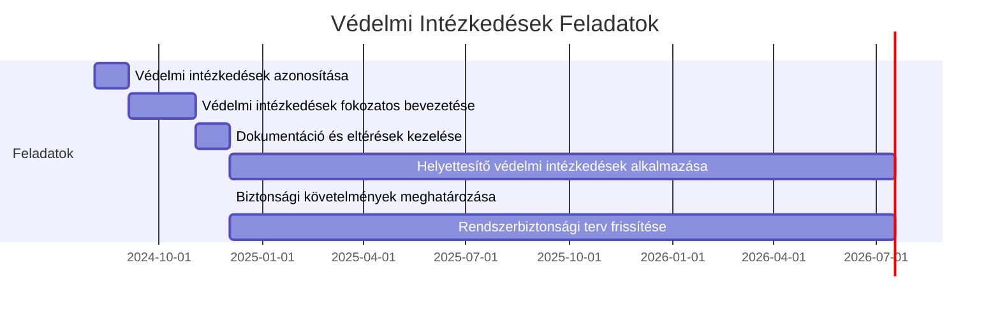

# NIS2 Keretrendszer alkalmazása, feladatok, határidők

1. **Kockázatkezelési keretrendszer alkalmazása**

* **Feladat:** Felkészülés a keretrendszer alkalmazására
* **Határidő:** A jogszabály hatályba lépésétől számított 3 hónap
* **Felelős:** Szervezet vezetője

2. **Biztonsági osztályba sorolás**

* **Feladat:** Az elektronikus információs rendszerek biztonsági osztályba sorolása
* **Határidő:** A kockázatkezelési keretrendszer felállítását követően 1 hónap
* **Felelős:** Kijelölt biztonsági szakértő

3. **Védelmi intézkedések beazonosítása**

* **Feladat:** A biztonsági osztályhoz tartozó védelmi intézkedések azonosítása
* **Határidő:** A biztonsági osztályba sorolást követően 1 hónap
* **Felelős:** Biztonsági csapat

4. **Rendszerbiztonsági terv elkészítése**

* **Feladat:** A kiválasztott védelmi intézkedések dokumentálása a rendszerbiztonsági tervben
* **Határidő:** A védelmi intézkedések azonosítását követően 1 hónap
* **Felelős:** Biztonsági csapat

5. ***Védelmi intézkedések végrehajtása**

* **Feladat:** A rendszerbiztonsági tervben dokumentált intézkedések végrehajtása
* **Határidő:** A rendszerbiztonsági terv elkészítését követően 2 hónap
* **Felelős:** IT és biztonsági csapat

6. **Védelmi intézkedések értékelése**

* **Feladat:** A megvalósított védelmi intézkedések értékelése
* **Határidő:** A végrehajtás befejezését követően 1 hónap
* **Felelős:** Kijelölt biztonsági szakértők

7. **Rendszer használatbavétele**

* **Feladat:** Döntés a rendszer használatbavételéről vagy folytatásáról
* **Határidő:** A védelmi intézkedések értékelését követően 1 hónap
* **Felelős:** Szervezet vezetője

8. **Folyamatos felügyelet és frissítések**

* **Feladat:** A védelmi intézkedések folyamatos felügyelete és a szükséges frissítések elvégzése
* **Határidő:** Folyamatosan, évente legalább egyszer
* **Felelős:** Biztonsági csapat

## Kockázatmenedzsment keretrendszer felállítása és dokumentálása

A 7/2024. MK rendelet alapján a Kockázatmenedzsment keretrendszer felállítása és dokumentálása alatti al-feladatok és határidők a következők:

1. **Szerepkörök, felelősségek, feladatok és hatáskörök meghatározása és dokumentálása**

* **Feladat:** Meghatározni és dokumentálni az elektronikus információs rendszerek védelmével kapcsolatos szerepköröket, felelősségeket, feladatokat és hatásköröket.
* **Határidő:** A keretrendszer felállításának kezdetétől számított 2 hét.

2. **Kockázatmenedzsment stratégia kidolgozása és dokumentálása**

* **Feladat:** Kidolgozni és dokumentálni a kockázatmenedzsment stratégiát, amely leírja, hogyan azonosítja, értékeli, kezeli és felügyeli a szervezet a biztonsági kockázatokat.
* **Határidő:** Az első feladat befejezését követően 2 hét.

3. **Biztonságfelügyeleti stratégia kidolgozása és dokumentálása**

* **Feladat:** Kidolgozni és dokumentálni a biztonságfelügyeleti stratégiát, amely magában foglalja a védelmi intézkedésekhez kapcsolódó tevékenységek ellenőrzésének gyakoriságát, felügyeletének módszereit és eszközeit.
* **Határidő:** A kockázatmenedzsment stratégia befejezését követően 2 hét.

4. **Üzleti célok, funkciók és folyamatok meghatározása és dokumentálása**

* **Feladat:** Meghatározni és dokumentálni az elektronikus információs rendszerek által támogatandó üzleti célokat, funkciókat és folyamatokat.
* **Határidő:** A biztonságfelügyeleti stratégia befejezését követően 1 hónap.

5. **Rendszer határainak meghatározása és dokumentálása**

* **Feladat:** Meghatározni és dokumentálni a rendszer szervezeti és technológiai határait, valamint az érintett vagyonelemeket, és az adatköröket.
* **Határidő:** Az üzleti célok és folyamatok dokumentálását követően 2 hét.

6. **Felelős személyek kijelölése**

* **Feladat:** Kijelölni a kockázatmenedzsment feladatokért felelős személyeket és dokumentálni a nevüket és felelősségi körüket.
* **Határidő:** A rendszer határainak meghatározását követően 1 hét.

## Biztonsági osztályba sorolás:
A 7/2024. MK rendelet alapján a biztonsági osztályba sorolás alatti al-feladatok a következők:

1. **Kockázatmenedzsment keretrendszer felállítása és dokumentálása:**

* **Feladat:** A keretrendszer alkalmazására való felkészülés, amely magában foglalja az elektronikus információs rendszerek védelmével kapcsolatos szerepkörök, felelősségek, feladatok és hatáskörök meghatározását és dokumentálását .
* **Határidő:** A jogszabály hatályba lépését követő 1 hónap.

2. **Hatáselemzés elvégzése:**

* **Feladat:** A szervezet elvégzi az elektronikus információs rendszerek hatáselemzését, amely alapján meghatározza a rendszerek biztonsági osztályát .
* **Határidő:** A keretrendszer felállítását követő 1 hónap.

3. **Biztonsági osztály meghatározása és dokumentálása:**

* **Feladat:** Az elektronikus információs rendszerek biztonsági osztályba sorolása a hatáselemzés eredményei alapján, majd az eredmények dokumentálása a rendszerbiztonsági tervben .
* **Határidő:** A hatáselemzés elvégzését követő 2 hét.

4. **Biztonsági osztályba sorolási döntés jóváhagyása:**

* **Feladat:** A szervezet vezetője jóváhagyja a biztonsági osztályba sorolási döntést .
* **Határidő:** A biztonsági osztály meghatározását követő 1 hét.

5. **Védelmi intézkedések beazonosítása:**

* **Feladat:** A biztonsági osztályhoz tartozó védelmi intézkedések azonosítása a kockázatmenedzsment keretrendszer alapján .
* **Határidő:** A biztonsági osztály meghatározását követő 2 hét.

6. **Rendszerbiztonsági terv elkészítése és jóváhagyása:**

* **Feladat:** A rendszerbiztonsági terv elkészítése, amely tartalmazza a biztonsági osztályba sorolás eredményeit és az azonosított védelmi intézkedéseket .
* **Határidő:** A védelmi intézkedések azonosítását követő 1 hónap.

## Védelmi intézkedések

A 7/2024. MK rendelet alapján a védelmi intézkedések feladatának alábbi al-feladatai és határidői a következők:

1. **Védelmi intézkedések azonosítása**
   * **Feladat:** Az elektronikus információs rendszer azon komponenseinek meghatározása, amelyek a védelmi intézkedések által megcélzott biztonsági képességet biztosítják vagy támogatják.
   * **Határidő:** A kockázatmenedzsment keretrendszer felállítását követően 1 hónap.

2. **Védelmi intézkedések fokozatos bevezetése**
   * **Feladat:** A védelmi intézkedések fokozatos bevezetése a védendő elektronikus információs rendszerek biztonsági osztályozása alapján.
   * **Határidő:** Az intézkedések azonosítását követően 2 hónap.

3. **Dokumentáció és eltérések kezelése**
   * **Feladat:** A védelmi intézkedések dokumentálása, beleértve az egyedi eltérések okait és mértékét, valamint azok megfelelőségének és hatékonyságának felülvizsgálata.
   * **Határidő:** A védelmi intézkedések fokozatos bevezetését követően 1 hónap.

4. **Helyettesítő védelmi intézkedések alkalmazása**
   * **Feladat:** Azon esetekben, amikor az adott biztonsági osztályhoz tartozó védelmi intézkedés nem alkalmazható, egyenértékű vagy összemérhető védelmet nyújtó helyettesítő intézkedések alkalmazása.
   * **Határidő:** Folyamatosan, a helyettesítési igény felmerülésekor.

5. **Biztonsági követelmények meghatározása**
   * **Feladat:** Az elektronikus információs rendszerekre értelmezendő és alkalmazandó biztonsági követelmények megállapítása, a kockázatelemzés alapján testre szabva.
   * **Határidő:** A dokumentáció és eltérések kezelését követően 1 hónap.

6. **Rendszerbiztonsági terv frissítése**
   * **Feladat:** A védelmi intézkedések tényleges megvalósítása és a tervtől való eltérések alapján a rendszerbiztonsági terv frissítése.
   * **Határidő:** Folyamatosan, a védelmi intézkedések végrehajtása során.

A fentiek alapján az al-feladatok és határidők az alábbi Mermaid formátumú Gantt diagrammal ábrázolhatók:

